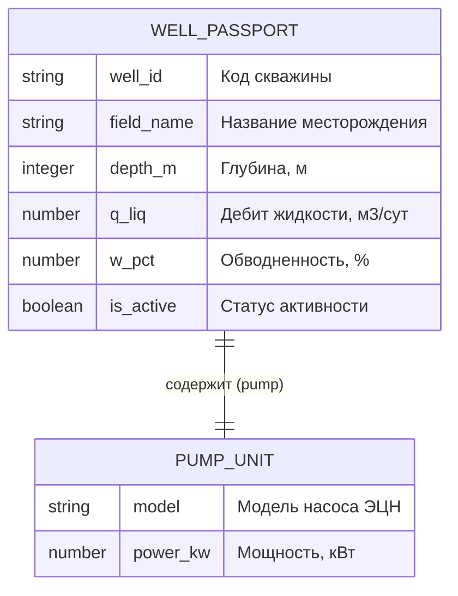

```mermaid
erDiagram
    WELL_PASSPORT ||--|| PUMP_UNIT : "содержит (pump)"
    WELL_PASSPORT {
        string well_id "Код скважины"
        string field_name "Название месторождения"
        integer depth_m "Глубина, м"
        number q_liq "Дебит жидкости, м3/сут"
        number w_pct "Обводненность, %"
        boolean is_active "Статус активности"
    }
    PUMP_UNIT {
        string model "Модель насоса ЭЦН"
        number power_kw "Мощность, кВт"
    }
```
